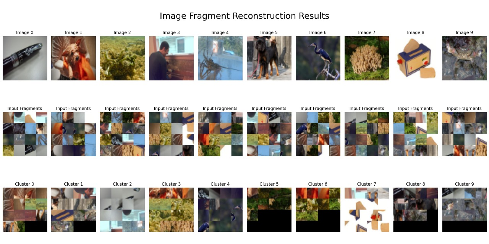

# Image Fragment Reconstruction

## Overview

This project aims to solve a fascinating problem: **reconstructing images that have been cut into fragments**. Imagine taking a photo, chopping it into pieces, then using a computer program to put it back together — automatically and without any labeled instructions.

We achieve this by building a **self-supervised convolutional neural network (CNN)** that learns from the fragmented images themselves. It figures out which pieces belong together by understanding the patterns and features within the images.

---

## How It Works (In Simple Terms)

1. **Data Fragmentation**:  
   We take complete images and cut them into smaller parts (fragments). These fragments are shuffled and serve as the input data.

2. **Self-Supervised Learning**:  
   Instead of using labeled data (where the correct answer is known), the CNN learns to group these fragments by finding similarities and relationships between them. This means the model teaches itself without any human guidance.

3. **Clustering**:  
   After learning features of fragments, the program groups pieces that likely belong to the same original image using a clustering method called **DBSCAN**.

4. **Evaluation**:  
   We measure how well the program did by comparing its groupings against the true original images, using metrics like **Adjusted Rand Index (ARI)** and **Normalized Mutual Information (NMI)**.

---

## Why This Matters

- It can help in real-world tasks like reconstructing torn or damaged photos, archaeological artifact restoration, or even puzzle-solving AI.
- Demonstrates the power of self-supervised learning without needing huge labeled datasets.
- Provides a foundation for more advanced image understanding systems.

---

## Project Features

- **Custom-built CNN model** designed specifically for fragmented image inputs
- Complete **data pipeline** from fragmentation to training
- Stable training achieving a validation loss of approximately 0.957
- Evaluation with robust clustering metrics (ARI and NMI)
- Flexible parameters to fine-tune clustering and training for better performance

---

## Sample Output

Below is an example of how the program works. The input is a set of image fragments (shuffled pieces), and the output groups fragments that belong together, effectively reconstructing the original image in clusters.



*In the image above, fragments belonging to the same cluster (i.e., same original image) are color-coded or grouped together by the algorithm.*

---

## Installation

1. Clone this repository:
   ```bash
   git clone https://github.com/yourusername/image-fragment-reconstruction.git
   cd image-fragment-reconstruction


(Optional) Create a virtual environment and activate it:

python -m venv venv
source venv/bin/activate  # On Windows: venv\Scripts\activate

Install dependencies:
pip install -r requirements.txt

Usage Guide
Preparing Your Data
Place your fragmented images in the data/ folder.

The code expects fragments of images, typically cut into fixed-size pieces.

Training the Model
Train the CNN model to learn from the fragmented images:


python train.py --data_dir data/
Evaluating the Model
After training, evaluate the quality of reconstruction:


python evaluate.py --data_dir data/
You will get metrics like ARI and NMI to see how well the fragments are grouped.

Understanding the Metrics
Adjusted Rand Index (ARI): Measures how accurately the clustering algorithm grouped fragments compared to the original images. A higher score means better reconstruction.

Normalized Mutual Information (NMI): Another way to measure the quality of clustering, showing how much information is shared between predicted and true groupings.

Current Challenges
Clustering quality is slightly affected by over-augmentation of fragments, which can confuse the model.

The ARI score currently hovers around 0.16, indicating room for improvement.

Next Steps
Fine-tune the clustering algorithm parameters (DBSCAN)

Adjust training loss functions for better feature separation

Experiment with augmentation strategies to improve fragment distinctiveness

Contributing
We welcome contributions! Whether it's fixing bugs, improving the model, or enhancing documentation — please submit a pull request or open an issue.

License
This project is licensed under the MIT License. See the LICENSE file for details.

Contact
For questions or collaborations, contact Daniel Muumbi at muuomuumbi@gmail.com.

Thank you for exploring the Image Fragment Reconstruction project!

This work demonstrates the power of self-supervised learning and image clustering techniques to rebuild fragmented data — a foundation that can be extended to many real-world applications. From advanced image restoration and digital forensics to puzzle solving and medical imaging, the possibilities are vast.

With this knowledge, you can experiment further by improving clustering accuracy, integrating more robust augmentation strategies, or applying the model to other fragmented or corrupted datasets. This project serves as a stepping stone toward smarter, more adaptive AI systems capable of understanding complex visual data in innovative ways.

Feel free to build upon this framework, contribute enhancements, or adapt it to your unique use case. The future of image reconstruction is full of exciting challenges and opportunities — and you’re now equipped to take part in it!


